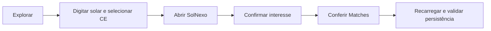

# Roteiro de apresentação — E2E com Cypress no Juntaí!

Material para sete slides. Na tela, use apenas os tópicos curtos; as notas abaixo
servem para fala. Distribua as partes entre os integrantes conforme o tamanho da
equipe. Resultados reais ficam em `cypress-resultados.md` e nos artefatos locais.

| Slide                     | Versão de 10 min | Versão de 15 min |
| ------------------------- | ---------------- | ---------------- |
| 1. Tema e objetivo        | 1 min            | 1 min            |
| 2. Como funciona          | 1 min            | 2 min            |
| 3. Cypress e configuração | 1 min            | 2 min            |
| 4. Código                 | 1,5 min          | 2 min            |
| 5. Execução prática       | 2,5 min          | 3 min            |
| 6. Falha e resultados     | 2 min            | 3 min            |
| 7. Aplicação e limites    | 1 min            | 2 min            |
| **Total**                 | **10 min**       | **15 min**       |

## Slide 1 — Testes de Ponta a Ponta: simulando o usuário real

**Na tela:** Fluxo real • Ações automatizadas • Resultados verificáveis.

**Fala:** “Vamos automatizar um investidor buscando uma startup, abrindo seu
perfil e demonstrando interesse. O Cypress verifica se ela aparece em Matches.”
Explique que o Juntaí! é a aplicação de demonstração e Cypress é a ferramenta.

**Visual:** captura `01-busca-solar` de uma execução real.

## Slide 2 — Como funciona um teste E2E?

**Na tela:** Usuário → Interface → Interação → Resposta → Validação.



**Fala:** unitário verifica uma regra; integração verifica colaboração entre
partes; E2E percorre um fluxo no navegador. Asserções comparam resposta e
expectativa. Repetir o cenário ajuda a identificar regressões. Aqui a sessão é
simulada e os dados são locais: API e banco reais não são validados.

## Slide 3 — Conhecendo o Cypress

**Na tela:** Configuração • Cenário • Command Log • Evidências.

**Visual:** três caixas: `cypress.config.ts` → `interesse-startup.cy.ts` →
`cypress/artifacts`. No modo interativo, mostre o Command Log ao lado da aplicação.

**Fala:** configuração define URL e navegador; o teste descreve interações;
headless produz resultado no terminal, capturas e vídeo. As consultas e
asserções aguardam condições automaticamente; não usamos pausas artificiais.

## Slide 4 — Código na prática

**Na tela:** exiba somente este trecho, extraído do cenário:

```ts
cy.get('input[aria-label="Buscar startups"]').type('solar');
cy.get('select[aria-label="Localização"]').select('CE');
cy.contains('a', 'Ver startup').click();
cy.location('pathname').should('eq', '/startups/solnexo');
cy.contains('button', /^Tenho interesse$/).click();
```

**Fala:** localizar campo → digitar → selecionar estado → clicar → conferir
rota → demonstrar interesse. Explique que o trecho vem depois de `cy.visit()`
e da preparação fictícia da sessão. Depois o cenário confirma o modal e
verifica o resultado em Matches. Não exiba conteúdo de armazenamento ou tokens.

## Slide 5 — Demonstração do teste em execução

**Na tela:** acompanhe o navegador; evite texto adicional.

**Antes:** `npm run cypress:demo:open`, selecionar E2E e o cenário.

**Durante:** mostre busca, filtro, perfil, confirmação, Matches e recarga.
No Command Log, aponte uma ação e uma asserção. Inspecione um snapshot.
Depois mostre o resultado headless previamente obtido com `npm run cypress:demo`.

**Fala:** “Não basta a página abrir: o match escolhido deve existir, a outra
startup deve ficar ausente e o interesse deve continuar registrado.”

## Slide 6 — Depuração e resultados

**Na tela:** Expectativa incorreta → erro → expectativa correta → nova execução.

**Visual:** captura da falha e os dois `resultado.json` reais.

**Demonstração:** `npm run cypress:demo:failure` espera um heading incorreto.
Aponte a mensagem de elemento não encontrado, o comando e o timeout. Compare
com o heading real `Seus matches`. Execute `npm run cypress:demo` novamente.

**Fala:** “Esta falha foi introduzida no teste para ensinar depuração; não prova
um defeito do produto.” Use as contagens registradas, sem inventar percentuais.
Na versão curta, mostre vídeo/captura previamente gravados e identifique isso.

## Slide 7 — Conclusão e aplicação no Juntaí!

**Na tela:** Regressão • Dados controlados • Manutenção • Cobertura limitada.

**Fala:** validamos o fluxo de interesse e persistência no navegador. Aprendemos
a preparar sessão fictícia, usar seletores acessíveis e interpretar falhas.
Esse cenário pode entrar no desenvolvimento contínuo e futuramente em CI.
Não cobre todo o produto, nem comprova a integração real com backend/banco.
Automação complementa testes unitários, integração e revisão manual.

## Preparação e contingência

Faça um ensaio completo. Reserve o maior tempo à execução e depuração.
Deixe disponíveis o teste, a configuração, os vídeos e os resumos reais.
Com rede indisponível, use dependências já instaladas e o fluxo local.
Com problema no navegador ao vivo, mostre evidências anteriores e explique
a limitação. Sem interface gráfica, apresente execução headless e gravação.
